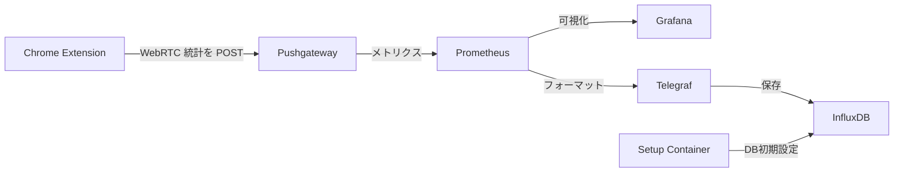

# WebRTC Internals Measurement

ブラウザからWebRTC統計情報を収集し，可視化および保存するためのシステムです．
メトリクス収集や可視化ツール，データベースをセットアップしたあと，[Chrome拡張機能](https://github.com/vpalmisano/webrtc-internals-exporter)を用いてデータを収集します．
本リポジトリには以下のサービスが含まれています．

- Prometheus: メトリクス収集
  - Pushgateway: メトリクスを受け取り，Prometheusに転送
- Grafana: メトリクス可視化
- Telegraf: メトリクスをInfluxDBに保存するためのフォーマット変換
- InfluxDB: メトリクス保存
- Setup Container: InfluxDBの初期設定を行うためのコンテナ



## Quick Start

### 1. サービスの起動

```bash
docker-compose up -d
```

### 2. Grafanaの初期設定

1. ブラウザで`http://localhost:3000`にアクセス
2. ユーザ名とパスワードを入力
   - ユーザ名: `admin`
   - パスワード: `adminpassword`
3. データソースの追加
   1. Prometheusを選択
   2. URLに`http://prometheus:9090`を入力
   3. `Save & Test`をクリック
4. ダッシュボードの追加
   1. `+`をクリック
   2. `Import`をクリック
   3. `Upload .json File`をクリック
   4. `grafana/template.json`を選択
   5. データソースを先ほど設定した`Prometheus`に設定
   6. `Import`をクリック

### 3. Chrome拡張機能の設定

[WebRTC Internals Exporter](https://chromewebstore.google.com/detail/webrtc-internals-exporter/jbgkajlogkmfemdjhiiicelanbipacpa?pli=1)をインストールし，設定画面で`http://localhost:9091`を入力します．

任意のWebRTC通信を行うページで拡張機能を有効にします．